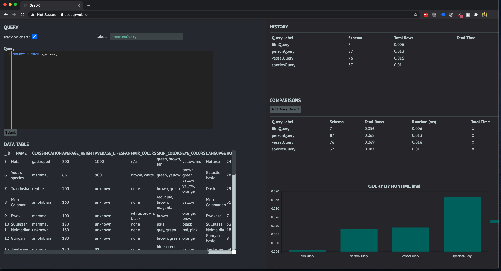
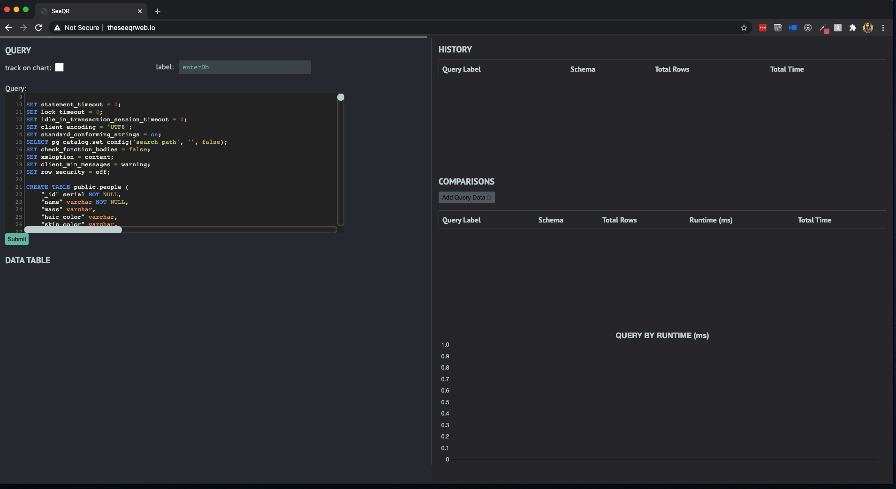

[theSeeQR.io](http://www.theseeqr.io)
[theSeeQRweb.io](http://theseeqrweb.io/)

<b>SeeQR: </b>A database analytic tool that compares the efficiency of different schemas and queries on a granular level to make better informed architectural decisions regarding SQL databases at various scales.

## Table of Contents

- [Beta Phase](#beta-phase)
- [Getting Started](#getting-started)
- [Built With](#built-with)
- [Interface & Features](#interface-&-features)
  - Schema import methods
  - Query input
  - Data
  - History
  - Results
  - Compare
  - Visualized Analytics
- [Application Architecture and Logic](#application-architecture-and-logic)
- [Core Team](#core-team)

## Beta Phase

SeeQR is still in BETA. Additional features, extensions, and improvements will continue to be introduced. If you encounter any issues with the application, please report them in the issues tab or submit a PR. Thank you for your interest!

## Getting Started

To get started on contributing to this project:

1. Fork or clone this repository
2. Npm install
   1. Run `npm install` for application-specific dependencies.
   2. Run global install for: `'typescript'`.
3. Install [Live Sass Compile](https://github.com/ritwickdey/vscode-live-sass-compiler) VSCode extension (settings are configured in the .vscode file in this repo), or set up your preferred Sass compiler
4. To run application during development
   1. `npm run dev` to launch SeeQR in localhost 3000 and webpack-dev-server.

## Built With

- [React](https://reactjs.org/)
- [React-Hooks](https://reactjs.org/docs/hooks-intro.html)
- [Typescript](https://www.typescriptlang.org/)
- [Chart.js](https://github.com/chartjs)
- [Faker.js](https://github.com/Marak/faker.js)
- [CodeMirror](https://codemirror.net/)
- [AWS](https://aws.amazon.com/)
- [PostgreSQL](https://www.postgresql.org/)
- [ElephantSQL](https://www.elephantsql.com/)

## Interface & Features

The whole interface in a nutshell

- Input Schema

  - New schemas can be imported into the application by pasting the contents of your `.sql` file into the query panel on the UI of the app.
  - Once you've imported the contents of the `.sql` file, you're ready to make queries!
  

    
  

- Query input

  - The center panel is where the query input text field is located, utilizing CodeMirror for SQL styling.
  - Users have option to execute a tracked or untracked query—simply check the box and provide a label to identify the query in later comparisons against other queries.
  - Toggle the submit button in the bottom left to send the query to the selected database.
    
  

  
  

    

- Data

  - The data table displays data returned by the inputted query.
  

    
  

- History

  - The history table shows the latest queries the user submitted irrespective of the database.
  - The history table also displays the total rows returned by the query and the total query execution time.
  

  
  

- Compare

  - The comparison table is flexible to the user’s preferences.
  - The user selects which queries they want to compare side by side from the ‘Add Query Data’ drop down.
  - They can add and remove queries as they see fit.

- Visualized Analytics

  - Upon each query execution, query runtime displays under the "Query Label vs Query Runtime" graph. Graph automatically interpolates as results enumerate.
  - User may toggle on specific query analytics results with the Comparisons panel to compare query performances.
  - Graph will be organized on x-axis by label, and colored by schema.

## Application Architecture and Logic

<b>Sandbox Environment</b> 
SeeQR streamlines the process of instantiating postgres databases by leveraging elephantSQL to import a copy of your database on the web. This means instances of databases are automatically created every time new schema data is inputted via the SeeQR GUI.

<b>Query Runtime Comparisons</b> 
One of the key features of SeeQR is to compare the efficiency of executing user-inputted queries. The SeeQR web app allows for you to see and compare the runtimes for each query you've tracked.

<b>Database Architecture</b> 
As of right now, the SeeQR web app allows for one database to be inputted and queried. We intend to add functionality

<b>Session-based Result Caching</b> 
The outcome results from each query, both retrieved data and analytics, are stored in the application’s state, which can be viewed and compared in table and visualizer formats. Note that these results’ persistence is session-based and will be cleared upon quitting the application.

## Core Team

<table>
<tr>
<td align="center">
 
<a href="https://github.com/catherinechiu">Catherine Chiu</a>
</td>
<td align="center">
 
<a href="https://github.com/serenackuo">Serena Kuo</a>
</td>
<td align="center">
 
<a href="https://github.com/FrankNorton32">Frank Norton</a>
</td>
<td align="center">
 
<a href="https://github.com/mercerstronck">Mercer Stronck</a>
</td>
<td align="center">
 
<a href="https://github.com/muhammadtrad">Muhammad Trad</a>
</td>
</tr></table>

<table align="center">
<td align="center">
 
<a href="https://github.com/justinD-A">Justin Dury-Agri</a>
</td>
<td align="center">
 
<a href="https://github.com/caseyescovedo">Casey Escovedo</a>
</td>
<td align="center">
 
<a href="https://github.com/frakes413">Sam Frakes</a>
</td>
<td align="center">
 
<a href="https://github.com/cwalker3011">Casey Walker</a>
</td>
</table>

<table align="center">
<td align="center">
 
<a href="https://github.com/chrisakinrinade">Chris Akinrinade</a>
</td>
<td align="center">
 
<a href="https://github.com/dkolotouros">James Kolotouros</a>
</td>
<td align="center">
 
<a href="https://github.com/jcourtner">Jennifer Courtner</a>
</td>
<td align="center">
 
<a href="https://github.com/kklochan">Katie Klochan</a>
</td>
</table>
